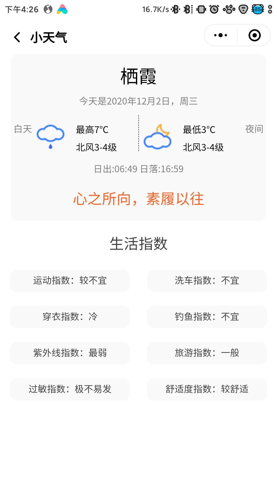

<h1>Meteor天气</h1>

## 1.功能简介

最近摸鱼学了学小程序，然后大了一个天气预报出来，欢迎体验：

包含以下功能：

* **当天及未来七天天气预报查看：** 数据来源于[和风天气个人开发版](https://dev.qweather.com/)。支持当天、逐小时、未来七天的天气预报。
    
  
  点击主页当前的天气（就是上图栖霞的那个字所在的View），即可查看当前城市的生活指数：
  
  
* **多个城市天气查看：** 主页支持多个城市的天气查看，**左右滑动即可切换城市**。鉴于性能考虑，设置最大城市个数为8个（包括当前定位城市）。如果一直添加城市，致使主页超过8个，则会将第一个城市删除（即定位城市后面的那一个城市），然后再添加所要添加的城市。*（如果需要修改最大城市的个数，可以手动修改`index.js`中`maxCity`的值）*

* **城市管理：** 可以点击主页左上角**加号按钮**，管理主页的城市，可以通过左滑`item`，删除不想要的城市。
    
  
  通过搜索城市，可以添加想要查看的城市，也可以直接选择定义的几个热门城市
  
## 2.数据来源

天气预报、生活指数、城市查询均来自于[和风天气个人开发版](https://dev.qweather.com/)，需要注意的是，**必须注册成个人开发者（需要提供身份证信息），才能使用七天的天气预报接口，否则只能使用三天的预报接口**。此外，使用到的天气图标也均来自[和风天气官方的图标](https://github.com/qwd/WeatherIcon)。其他的一些图标来自于[Iconfont](https://www.iconfont.cn/)

## 3.使用方法

* 直接扫描最上面的小程序码即可体验完整功能
* 申请得到和风天气的key后（具体申请流程见[和风天气的开发文档](https://dev.qweather.com/docs/start/get-api-key)）,将自己的key复制到`util.js`中的`KEY `中，然后用微信开发工具编译即可使用

## 4. 使用到的第三方库

因为swiper不支持下拉刷新，所以使用了GitHub上的[下拉刷新库](https://github.com/luyimei/mina-pull-down-refresh)，感谢原作者的贡献

目前项目还在不断更新，不断完善，优化体验中，敬请期待。

最后，码字不易，**希望能给个star，您的支持是我最大的动力，谢谢！**

